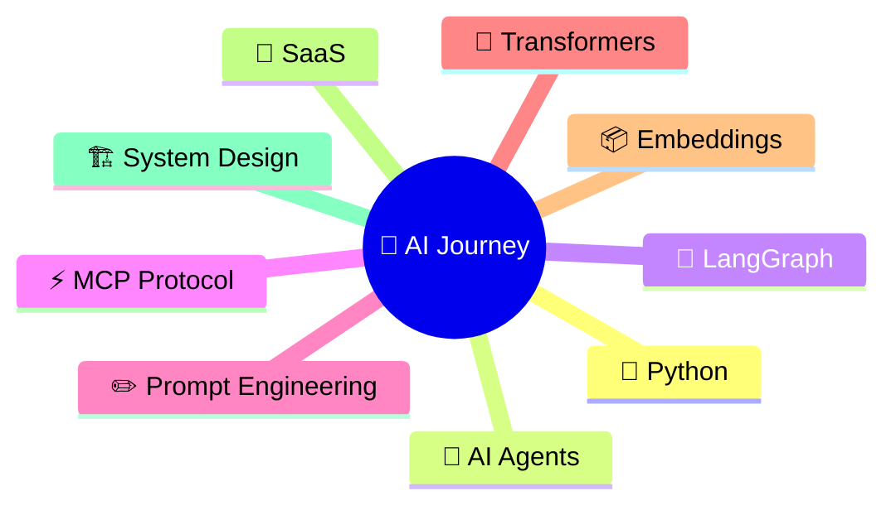

<div align="center">
  


<br/>


<br/><br/>


</div>

---


## &nbsp;🧠 AI Journey

<div align="center">



</div>

---

## &nbsp;⚡ Status

```yaml
╔══════════════════════════════════════════════════════════╗
  Status        : Learning & Exploring
  Focus         : Artificial Intelligence
  Approach      : Build → Test → Improve → Repeat
  Current Stage : AI Projects + Software Systems
╚══════════════════════════════════════════════════════════╝
```

---

## &nbsp;🚀 Currently Exploring & Learning

<div align="center">

|  |  |  |
|:---:|:---:|:---:|
|  |  |  |
|  |  |  |
|  |  |  |

</div>

---

## &nbsp;🛠️ Technology Stack

<div align="center">

### &nbsp;AI & Machine Learning


### &nbsp;Development


### &nbsp;Tools


</div>

---

## &nbsp;🚀 Project Portfolio

<div align="center">

| &nbsp; | Project | Stack |
|:---:|:---|:---|
| 🌐 | **Zyphoryx Launch Forge AI** | `Startup Ideas` `Brand Concepts` `Launch Strategies` `Growth Planning` |
| 🎨 | **AI Brand Builder** | `Brand Names` `Taglines` `Slogans` `Identity Concepts` |
| 🤖 | **Multi-Model AI Platform** | `4 AI Models` `Unified Interface` `AI Workflow` `Model Comparison` |
| 📊 | **Data Analytics Platform** | `Data Processing` `Dashboards` `Insights` `Analytics` |
| 🧪 | **H2A2 Website Testing** | `Testing` `UX Review` `Improvements` |

</div>

---

## &nbsp;📊 GitHub Analytics

<div align="center">


&nbsp;&nbsp;


<br/><br/>


</div>

---

## &nbsp;📈 Contribution Activity

<div align="center">

[](https://github.com/Haafil17)

</div>

---

## &nbsp;🎯 Current Objectives

```diff
+ Build More AI Products
+ Improve Python Skills
+ Explore Agentic AI
+ Learn Software Architecture
+ Launch SaaS Products
+ Work With Clients
```

---

<div align="center">


### Building &nbsp;•&nbsp; Learning

<br/>


</div>
