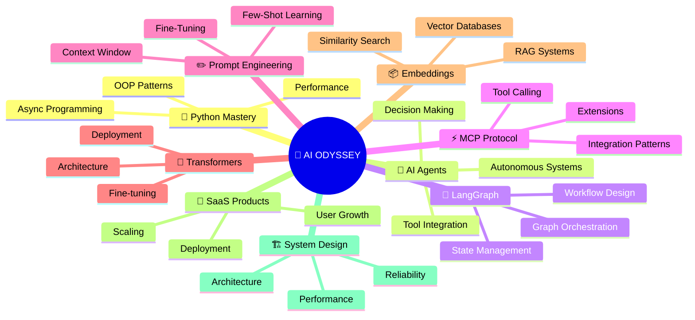

<div align="center">
  


<br/>


<br/><br/>

<a href="https://github.com/Haafil17">
  
</a>

</div>

---


##  

<div align="center">



</div>

---

## 

<div align="center">

```
╔════════════════════════════════════════════════════════════╗
║  Status        🎯 Learning & Exploring                    ║
║  Focus         🔬 Artificial Intelligence & AI Systems    ║
║  Approach      🔄 Build → Test → Improve → Deploy         ║
║  Current Stage 🚀 Advanced AI Projects + Architecture      ║
╚════════════════════════════════════════════════════════════╝
```

</div>

---

## 

<div align="center">

| | | |
|:---:|:---:|:---:|
|  |  |  |
|  |  |  |
|  |  |  |

</div>

---

## 

<div align="center">

### 🤖 AI & Machine Learning


### 💻 Development


### 🚀 Tools & Platforms


</div>

---

## 

<div align="center">

| Project | Description | Stack |
|:---:|:---|:---|
| 🌐 **Zyphoryx Launch Forge AI** | AI-powered startup ideation & brand strategy | LLMs • Prompt Engineering • SaaS |
| 🎨 **AI Brand Builder** | Intelligent branding & identity generation | Python • LLMs • Transformers |
| 🤖 **Multi-Model AI Platform** | Unified interface for 4 AI models | JavaScript • React • LangGraph |
| 📊 **Data Analytics Platform** | Advanced analytics & insights dashboard | Python • Data Processing • Visualization |
| 🧪 **H2A2 Website Testing** | Comprehensive UX testing & optimization | Testing • UX Review • Performance |
| 🔮 **AI Agents Suite** | Autonomous agent orchestration system | LangGraph • MCP • Python |

</div>

---

## 

<div align="center">


&nbsp;&nbsp;&nbsp;


<br/><br/>


</div>

---

## 

<div align="center">

[](https://github.com/Haafil17)

</div>

---

## 

<div align="center">

```diff
+ 🚀 Build Production AI Products
+ 🧠 Master AI Agent Architecture
+ 🔗 Deep Dive into LangGraph & MCP
+ 🏗️ System Design & Scalability
+ 💼 Launch SaaS Products
+ 🤝 Collaborate with AI Teams
+ 📚 Share Knowledge & Mentor
+ 🔬 Research & Experimentation
```

</div>

---

## 

<div align="center">

```
Phase 1: Foundations ✅
├─ Python Mastery
├─ AI Fundamentals
└─ Web Development

Phase 2: Advanced AI 🔄
├─ Transformers & LLMs
├─ LangGraph Mastery
└─ AI Agents

Phase 3: Production 🚀
├─ System Architecture
├─ SaaS Development
└─ Deployment & Scaling
```

</div>

---

<div align="center">


<br/>

<a href="https://github.com/Haafil17">
  
</a>
&nbsp;
<a href="mailto:your-email@example.com">
  
</a>
&nbsp;
<a href="https://twitter.com/your-handle">
  
</a>

<br/><br/>

> *Building the future, one AI system at a time* ✨


</div>
