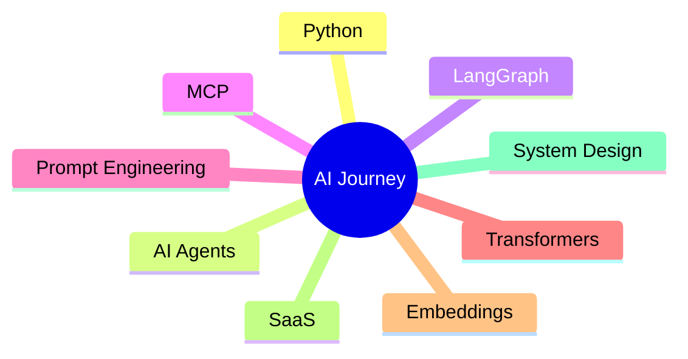

<div align="center">


# Mohammed Haafil

### AI Enthusiast • High Volume Vibe Coder 


</div>

---



# 🧠 AI Learning Journey

```yaml
Status: Learning & Exploring
Focus: Artificial Intelligence
Approach: Build → Test → Improve → Repeat
Current Stage: AI Projects + Software Systems
```

---

# ⚡ Currently Exploring and Learninng

<table>
<tr>
<td>🤖 AI Agents</td>
<td>🔗 LangGraph</td>
<td>⚡ MCP Protocol</td>
</tr>

<tr>
<td>🧠 Transformers</td>
<td>📦 Embeddings</td>
<td>🛡️ Guardrails</td>
</tr>

<tr>
<td>🔍 RAG</td>
<td>🧩 Context Engineering</td>
<td>🎯 AI Orchestration</td>
</tr>
</table>

---

# 🛠️ Technology Stack Currently Exploring

### AI & Machine Learning


### Development


### Tools


)


---

# 🚀 Project Portfolio

### 🌐 Zyphoryx Launch Forge AI

```diff
+ Startup Ideas
+ Brand Concepts
+ Launch Strategies
+ Growth Planning
```

### 🎨 AI Brand Builder

```diff
+ Brand Names
+ Taglines
+ Slogans
+ Identity Concepts
```

### 🤖 Multi-Model AI Platform

```diff
+ 4 AI Models
+ Unified Interface
+ AI Workflow Experiments
+ Model Comparison
```

### 📊 Data Analytics Platform

```diff
+ Data Processing
+ Dashboards
+ Insights
+ Analytics
```


### 🧪 H2A2 Website Testing

```diff
+ Testing
+ UX Review
+ Improvements
```

---

# 📊 GitHub Analytics

<div align="center">


</div>

<div align="center">


</div>

---

# 📈 Contribution Activity

[](https://github.com/Haafil17)

---

# 🎯 Current Objectives

- Build More AI Products
- Improve Python Skills
- Explore Agentic AI
- Learn Software Architecture
- Launch SaaS Products
- Work With Clients

---

<div align="center">

## ⚡ HIGH VOLUME VIBE CODER

### Building • Learning 

</div>
