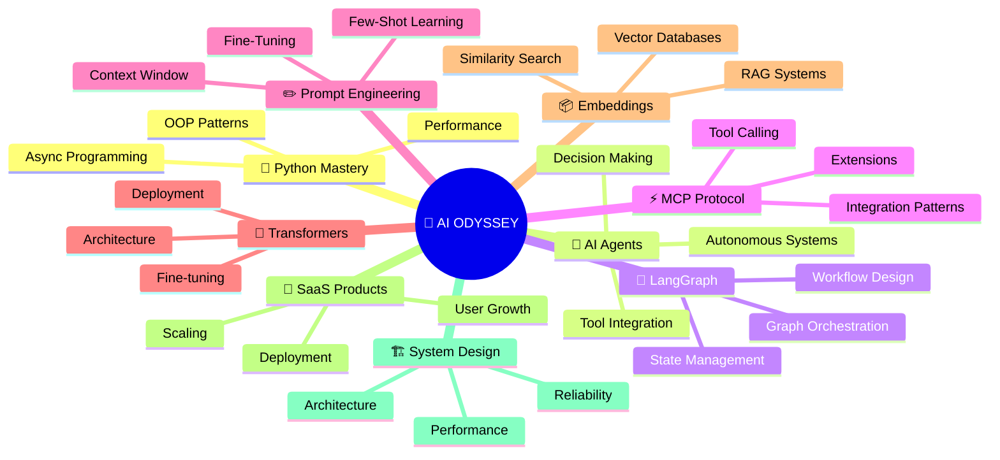

<div align="center">
  


<br/>


<br/><br/>

<a href="https://github.com/Haafil17">
  
</a>

</div>

---


##  

<div align="center">



</div>

---

## 

<div align="center">

```
╔════════════════════════════════════════════════════════════╗
║  Status        🎯 Learning & Exploring                    ║
║  Focus         🔬 Artificial Intelligence & AI Systems    ║
║  Approach      🔄 Build → Test → Improve → Deploy         ║
║  Current Stage 🚀 Advanced AI Projects + Architecture      ║
╚════════════════════════════════════════════════════════════╝
```

</div>

---

# 🤖 AI & MACHINE LEARNING


## 🧠 AI Fundamentals & Core Concepts

<div align="center">

| | | |
|:---:|:---:|:---:|
|  |  |  |

</div>

---

## 🔗 LangGraph & Orchestration

<div align="center">

| | | |
|:---:|:---:|:---:|
|  |  |  |
|  |  |  |

</div>

---

## ⚡ MCP Protocol & Tool Integration

<div align="center">

| | | |
|:---:|:---:|:---:|
|  |  |  |
|  |  |  |

</div>

---

## 🧠 Transformers & Deep Learning

<div align="center">

| | | |
|:---:|:---:|:---:|
|  |  |  |
|  |  |  |

</div>

---

## 📦 Embeddings & Vector Search

<div align="center">

| | | |
|:---:|:---:|:---:|
|  |  |  |
|  |  |  |

</div>

---

## ✏️ Prompt Engineering & Optimization

<div align="center">

| | | |
|:---:|:---:|:---:|
|  |  |  |
|  |  |  |

</div>

---

## 🔍 RAG Systems & Knowledge Retrieval

<div align="center">

| | | |
|:---:|:---:|:---:|
|  |  |  |
|  |  |  |

</div>

---

## 🛡️ AI Safety & Guardrails

<div align="center">

| | | |
|:---:|:---:|:---:|
|  |  |  |
|  |  |  |

</div>

---

## 🧩 Context Engineering & Design

<div align="center">

| | | |
|:---:|:---:|:---:|
|  |  |  |
|  |  |  |

</div>

---

## 🎯 AI Orchestration & Automation

<div align="center">

| | | |
|:---:|:---:|:---:|
|  |  |  |
|  |  |  |

</div>

---

# 💻 WEB DEVELOPMENT


## 🐍 Python & Backend Development

<div align="center">

| | | |
|:---:|:---:|:---:|
|  |  |  |
|  |  |  |
|  |  |  |

</div>

---

## 🎨 Frontend & UI/UX

<div align="center">

| | | |
|:---:|:---:|:---:|
|  |  |  |
|  |  |  |
|  |  |  |

</div>

---

## ⚛️ React & JavaScript Frameworks

<div align="center">

| | | |
|:---:|:---:|:---:|
|  |  |  |
|  |  |  |
|  |  |  |

</div>

---

## 📘 JavaScript & TypeScript

<div align="center">

| | | |
|:---:|:---:|:---:|
|  |  |  |
|  |  |  |
|  |  |  |

</div>

---

## 🎯 API & Backend Integration

<div align="center">

| | | |
|:---:|:---:|:---:|
|  |  |  |
|  |  |  |
|  |  |  |

</div>

---

## 📦 Databases & Data Management

<div align="center">

| | | |
|:---:|:---:|:---:|
|  |  |  |
|  | -Learning-7b4aff?style=for-the-badge&labelColor=0d0221&color=5b3aff) |  |
|  |  |  |

</div>

---

## 🚀 Deployment & DevOps

<div align="center">

| | | |
|:---:|:---:|:---:|
|  |  |  |
|  |  |  |
|  |  |  |

</div>

---

## 🔧 Tools & Technologies

<div align="center">

| | | |
|:---:|:---:|:---:|
|  |  |  |
|  |  |  |
|  |  |  |

</div>

---

# 🚀 CURRENTLY EXPLORING & LEARNING


<div align="center">

| | | |
|:---:|:---:|:---:|
|  |  |  |
|  |  |  |
|  |  |  |

</div>

---

# 🏗️ BUILDING WITH


<div align="center">

| | | |
|:---:|:---:|:---:|
|  |  |  |
|  |  |  |
|  |  |  |
|  |  |  |

</div>

---

## 

<div align="center">

| Project | Description | Stack |
|:---:|:---|:---|
| 🌐 **Zyphoryx Launch Forge AI** | AI-powered startup ideation & brand strategy | LLMs • Prompt Engineering • SaaS |
| 🎨 **AI Brand Builder** | Intelligent branding & identity generation | Python • LLMs • Transformers |
| 🤖 **Multi-Model AI Platform** | Unified interface for 4 AI models | JavaScript • React • LangGraph |
| 📊 **Data Analytics Platform** | Advanced analytics & insights dashboard | Python • Data Processing • Visualization |
| 🧪 **H2A2 Website Testing** | Comprehensive UX testing & optimization | Testing • UX Review • Performance |
| 🔮 **AI Agents Suite** | Autonomous agent orchestration system | LangGraph • MCP • Python |

</div>

---

## 

<div align="center">


&nbsp;&nbsp;&nbsp;


<br/><br/>


</div>

---

## 

<div align="center">

[](https://github.com/Haafil17)

</div>

---

## 

<div align="center">

```diff
+ 🚀 Build Production AI Products
+ 🧠 Master AI Agent Architecture
+ 🔗 Deep Dive into LangGraph & MCP
+ 🏗️ System Design & Scalability
+ 💼 Launch SaaS Products
+ 🤝 Collaborate with AI Teams
+ 📚 Share Knowledge & Mentor
+ 🔬 Research & Experimentation
```

</div>

---

## 

<div align="center">

```
Phase 1: Foundations ✅
├─ Python Mastery
├─ AI Fundamentals
└─ Web Development

Phase 2: Advanced AI 🔄
├─ Transformers & LLMs
├─ LangGraph Mastery
└─ AI Agents

Phase 3: Production 🚀
├─ System Architecture
├─ SaaS Development
└─ Deployment & Scaling
```

</div>

---

<div align="center">


<br/>

<a href="https://github.com/Haafil17">
  
</a>
&nbsp;
<a href="mailto:your-email@example.com">
  
</a>
&nbsp;
<a href="https://twitter.com/your-handle">
  
</a>

<br/><br/>

> *Building the future, one AI system at a time* ✨


</div>
